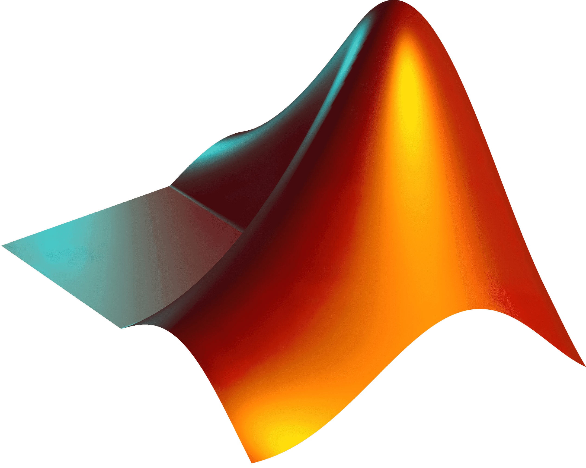

# Open-Source Biomedical Instrumentation Laboratory

This repository contains educational materials, hardware designs, and software tools to support open-source biomedical instrumentation labs for academic use.

---

## 📂 Repository Structure

- `hardware/` – Circuit schematics, board designs, and hardware documents (licensed under CERN-OHL-W v2)
- `software/` – MATLAB scripts, Arduino firmware, and data processing tools (licensed under MIT)
- `docs/` – Lab manuals, educational guides, and documentation (licensed under CC BY 4.0)

---

## 🔐 Licenses

| Folder     | Content                            | License                          |
|------------|------------------------------------|----------------------------------|
| hardware/  | PCB designs, schematics            | [CERN-OHL-W v2.0](https://ohwr.org/project/cernohl/wikis/Documents/CERN-OHL-version-2) |
| software/  | Arduino/MATLAB source code         | [MIT License](https://opensource.org/licenses/MIT) |
| docs/      | Lab manuals, written guides        | [CC BY 4.0](https://creativecommons.org/licenses/by/4.0/) |

Each folder contains its respective license file.

---

## 👨‍🏫 Usage

This material is designed for educators and researchers in biomedical engineering. You're welcome to:
- Use these materials in your own labs or classrooms.
- Modify or extend the designs for your own needs.
- Contribute improvements via pull requests or issues.

If you need to start with a brief **MATLAB introduction**, I recommend starting with the live scripts found in [`software/matlab/liveScripts`](software/matlab/liveScripts/)

---

## 🧰 Software and Materials Needed
- **Software:**
  -  [MATLAB 2025a or newer](https://www.mathworks.com/products/matlab.html)
  -  [Arduino IDE](https://www.arduino.cc/en/software/)

- **Materials:**
  - Arduino UNO R4 WIFI
 
--- 

## 🙏 Acknowledgments

Created and maintained by **Daniel Duque Urrego**, Ph.D. student in Biomedical Engineering at West Virginia University.

Contact Information:
- daniel.duqueurrego@mail.wvu.edu
- daniel.duqueu@gmail.com

---

## 💬 Contributions Welcome

We encourage contributions! If you'd like to report an issue, suggest an improvement, or contribute your own designs or code, please submit a pull request or open an issue.
